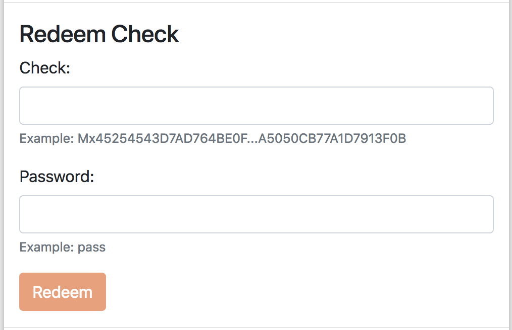

Minter Check
============

Minter Check is like an ordinary bank check. Each user of network can issue check with any amount of coins
and pass it to another person. Receiver will be able to cash a check from arbitrary account.

Introduction
^^^^^^^^^^^^

Checks are prefixed with "Mc". Here is example of a Minter Check:

.. code-block:: text

    Mcf89b01830f423f8a4d4e5400000000000000843b9aca00b8419b3beac2c6ad88a8bd54d2
    4912754bb820e58345731cb1b9bc0885ee74f9e50a58a80aa990a29c98b05541b266af99d3
    825bb1e5ed4e540c6e2f7c9b40af9ecc011ca0387fd67ec41be0f1cf92c7d0181368b4c67a
    b07df2d2384192520d74ff77ace6a04ba0e7ad7b34c64223fe59584bc464d53fcdc7091faa
    ee5df0451254062cfb37

Each Minter Check has:
    - **Nonce** - unique "id" of the check.
    - **Coin Symbol** - symbol of coin.
    - **Value** - amount of coins.
    - **Due Block** - defines last block height in which the check can be used.
    - **Lock** - secret to prevent hijacking.
    - **Signature** - signature of issuer.

Check hijacking protection
^^^^^^^^^^^^^^^^^^^^^^^^^^

Minter Checks are issued offline and do not exist in blockchain before "cashing".
So we decided to use special passphrase to protect checks from double-activating. Hash of this passphrase is used
as private key in ECDSA to prove that sender is the one who owns the check.

*TODO: describe algorithm*

How to issue a Minter Check
^^^^^^^^^^^^^^^^^^^^^^^^^^^

For issuing Minter Check you can use our `tool <https://minter-coupon.dl-dev.ru/>`__.

You will need to fill a form:
    - **Nonce** - unique "id" of the check.
    - **Coin Symbol** - symbol of coin.
    - **Value** - amount of coins.
    - **Pass phrase** - secret phrase which you will pass to receiver of the check.
    - **Private key** - private key of an account with funds to send.

How to cash a Minter Check
^^^^^^^^^^^^^^^^^^^^^^^^^^

To redeem a check user should have:
    - Check itself
    - Secret passphrase

After redeeming balance of user will increased instantly.

Commission
^^^^^^^^^^

There is no commission for issuing a check because it done offline. In the moment of
cashing issuer will pay standard "send" commission.
