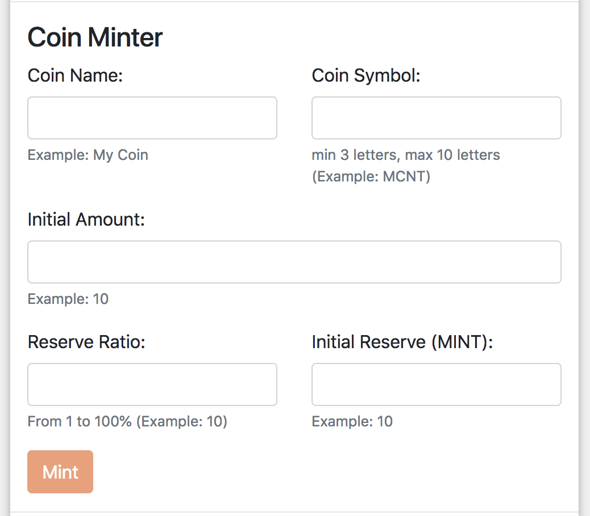

Coins
=====

Minter Blockchain is multi-coin system.

| Base coin in testnet is ``MNT``.
| Base coin in mainnet is ``BIP``.

| Smallest part of a coin is called ``pip``.
| 1 pip = 1^-18 of any coin. In Blockchain and API we only operating with pips.

Coin Issuance
^^^^^^^^^^^^^

Every user of Minter can issue own coin. Each coin is backed by base coin in some proportion.
Issue own coin is as simple as filling a form with given fields:

- **Coin name** - Name of a coin. Arbitrary string.
- **Coin symbol** - Symbol of a coin. Must be unique, alphabetic, uppercase, 3 to 10 letters length.
- **Initial supply** - Amount of coins to issue. Issued coins will be available to sender account.
- **Initial reserve** - Initial reserve in base coin.
- **Constant Reserve Ratio (CRR)** - uint, should be from 10 to 100.

After coin issued you can send is as ordinary coin using standard wallets.

Issuance Fees
^^^^^^^^^^^^^

To issue a coin Coiner should pay fee. Fee is depends on length of Coin Symbol.

| 3 letters – 1 000 000 bips + standard transaction fee
| 4 letters – 100 000 bips + standard transaction fee
| 5 letters – 10 000 bips + standard transaction fee
| 6 letters – 1000 bips + standard transaction fee
| 7 letters – 100 bips + standard transaction fee
| 8 letters – 10 bips + standard transaction fee
| 9-10 letters - just standard transaction fee

Coin Exchange
^^^^^^^^^^^^^

Each coin in system can be instantly exchanged to another coin. This is possible because each coin has "reserve" in base
coin.

Here are some formulas we are using for coin conversion:

CalculatePurchaseReturn
    Given a coin supply (s), reserve balance (r), CRR (c) and a deposit amount (d),
    calculates the return for a given conversion (in the base coin):

::

    return s * ((1 + d / r) ^ d - 1);

CalculateSaleReturn
    Given a coin supply (s), reserve balance (r), CRR (c) and a sell amount (a),
    calculates the return for a given conversion

::

    return r * (1 - (1 - a / s) ^ (1 / c));